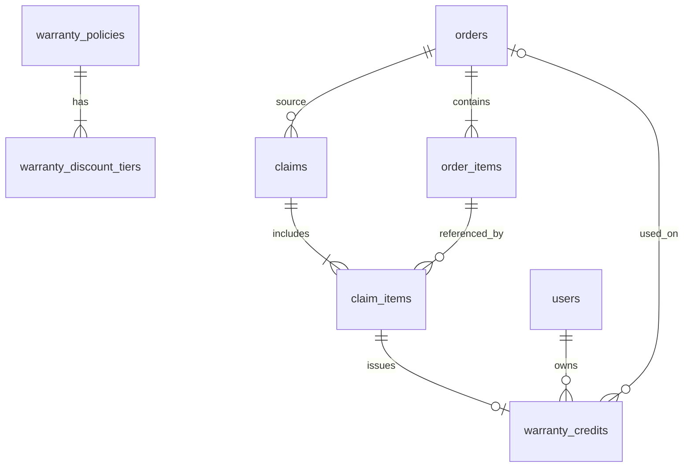

# Warranty Discount Credits System — Design Spec (ASF-2)

**Date**: 2026-07-09  
**Status**: Approved for implementation  
**Stakeholder**: Simon  
**Companion prompts**: `2026-07-09-warranty-discount-credits-agent-prompts.md`  
**Builds on**: Post-Purchase Claims module (`2026-06-26-post-purchase-claims-module.md`)

---

## 1. Executive summary

Revamp the existing **Post-Purchase Claims** module (`claims` feature flag) into a **human-verified warranty credit system**:

1. Customer submits a claim (photos + description) against one or more order line items.
2. System shows an **estimated** credit based on merchant-configured time tiers — **nothing is issued automatically**.
3. Staff reviews evidence and approves (with optional % override per item).
4. System issues **fixed RM warranty credits** locked to the customer account.
5. Customer applies credits **one-click in cart** on any product in the store.
6. Credits expire **1 year** after approval and are **single-use**.

**Critical rule**: Tier discounts are **recommendations only**. No credit, refund, or cart discount is granted without staff approval. This prevents abuse (e.g. fake photos).

---

## 2. Problem with current system

The v1 claims module (`asf-2-next/src/modules/claims/`) provides:

- Customer claim submission from order line items
- Staff review queue and status workflow
- Audit logs and notifications
- Refund handoff link to payments (manual)

**Gaps vs desired warranty model:**

| Gap | Impact |
|-----|--------|
| No time-based discount tiers | Binary eligible/ineligible only |
| Policy hardcoded in `claimPolicyConfig.ts` | Merchant cannot configure tiers without deploy |
| No computed credit amount | Staff manually decides resolution |
| No redemption mechanism | `store_credit` resolution is a label only |
| Single item per claim | Cannot claim multiple items in one submission |
| Uses `order.created_at` as delivery proxy | Tier timing inaccurate |
| Client-side Supabase only | Credit amounts could be tampered if added client-side |

---

## 3. Design decisions (locked)

| Question | Decision |
|----------|----------|
| Redemption method | **One-click cart credit** (not promo codes, not refund-only) |
| Discount basis | **% of original item purchase price** → fixed RM credit |
| Product scope | **Any product in store** |
| Claim types using auto tiers | **Manufacturing defect / warranty only**; other types (size exchange, wrong item, delivery damage) have no auto tier — staff sets % manually (often 100%) |
| Staff override | **All staff** can adjust recommended % before issuing |
| Partial approval | **Yes** — staff can set e.g. 50% when recommended is 75% |
| Credit expiry | **1 year (365 days)** after approval |
| Multi-item claims | **Yes** — one claim can cover multiple order line items |
| Credit granularity | **One credit per line item** (not one lump sum per claim) |
| Human verification | **Required** — credits issued only on staff approve |

---

## 4. Three-stage model

```
┌─────────────┐     ┌──────────────────┐     ┌─────────────────┐
│  ESTIMATE   │ ──► │  VERIFY (human)  │ ──► │  ISSUE + REDEEM │
│  (system)   │     │  (staff)         │     │  (system)       │
└─────────────┘     └──────────────────┘     └─────────────────┘
```

### Stage 1 — Estimate (customer-facing, non-binding)

- Customer selects order item(s) and claim type.
- System calculates days since delivery.
- For `manufacturing_defect`: look up merchant tier table → show **estimated %** and **estimated RM credit** per item.
- For other claim types: show message that staff will determine credit; no auto tier.
- UI label must say **"Estimated credit if approved"** — never guaranteed.

### Stage 2 — Verify (staff)

- Staff reviews photos, order history, customer claim history.
- Per line item: sees recommended tier %, can edit approved %.
- Actions: Approve & Issue Credits, Request More Info, Reject.
- On approve: system creates `warranty_credits` rows (server-side).

### Stage 3 — Issue + Redeem (customer)

- Customer notified: credits issued.
- Credits visible in **My Account → Warranty Credits** and in **cart**.
- One-click **Apply** in cart.
- Checkout validates credit server-side; marks credit `used` on successful order.

---

## 5. Credit calculation

### Formula (per order line item)

```
credit_amount_myr = line_item_paid_price × (approved_percent / 100)
```

- `line_item_paid_price`: amount customer paid for that line item (from `order_items` + product price at time of order; use existing order line pricing fields).
- `approved_percent`: staff-confirmed % (defaults to tier recommendation for manufacturing defect).
- Result is a **fixed RM amount**, not a % off the next purchase.

### Example

| Item | Paid | Tier % | Approved % | Credit issued |
|------|------|--------|------------|---------------|
| Nike Air Max | RM 250 | 75% | 75% | RM 187.50 |
| Nike Socks | RM 30 | 75% | 50% (partial) | RM 15.00 |

Customer can spend RM 187.50 on a RM 400 jacket → pays RM 212.50.

### Default tier table (merchant-configurable)

| Days since delivery | Discount % |
|---------------------|------------|
| 0–30 | 75% |
| 31–60 | 50% |
| 61–90 | 25% |
| 91–365 | 10% |
| 366+ | 0% (ineligible for auto tier) |

Merchants edit day ranges and percentages in admin settings. Manufacturing defect claims use this table; other claim types do not auto-apply tiers.

---

## 6. Claim types and tier behavior

| Claim type key | Label (current) | Auto tier? | Typical staff action |
|----------------|-----------------|------------|----------------------|
| `manufacturing_defect` | 制造缺陷 | **Yes** | Approve at recommended % or override |
| `size_exchange` | 尺码退换 | No | Full exchange or staff-set % |
| `wrong_item` | 发错商品 | No | Usually 100% |
| `delivery_damage` | 运输损坏 | No | Usually 100% |

Configurable later: merchant can toggle which types use tiers. v1: manufacturing defect only.

---

## 7. Abuse prevention

| Safeguard | Implementation |
|-----------|----------------|
| Human verification required | Credits created only via staff approve API |
| Must link to real delivered order line item | Validate `order.status` ∈ `delivered`, `completed` |
| One active claim per order line item | DB unique partial index or app check: no duplicate open claims on same `order_item_id` |
| Photos required for defect claims | Keep `requiresPhotos` from `claimPolicyConfig` |
| Credits account-locked | `warranty_credits.user_id` — validate at cart apply |
| Single-use per credit | `status`: `active` → `used` on checkout |
| Expiry | `expires_at` = approved_at + 365 days |
| Server-side credit issuance | Staff approve calls API with service role; client cannot self-issue |
| Server-side cart validation | New API mirrors `POST /api/promotions/validate` pattern |
| Audit trail | Extend `claim_status_change_logs`; log credit issuance |
| Customer copy | Always "estimated" until approved |

---

## 8. Data model

### New tables

#### `warranty_policies`

Store-wide warranty policy (one active policy per deployment in v1).

```sql
warranty_policies (
  id UUID PRIMARY KEY,
  name TEXT NOT NULL,
  active BOOLEAN NOT NULL DEFAULT true,
  max_warranty_days INTEGER NOT NULL DEFAULT 365,
  credit_expiry_days INTEGER NOT NULL DEFAULT 365,
  module_label TEXT,                    -- e.g. "Warranty & Returns"
  created_at TIMESTAMPTZ NOT NULL DEFAULT NOW(),
  updated_at TIMESTAMPTZ NOT NULL DEFAULT NOW()
)
```

#### `warranty_discount_tiers`

Time-based tiers within a policy.

```sql
warranty_discount_tiers (
  id UUID PRIMARY KEY,
  policy_id UUID NOT NULL REFERENCES warranty_policies(id) ON DELETE CASCADE,
  days_from INTEGER NOT NULL,           -- inclusive, e.g. 0
  days_to INTEGER NOT NULL,             -- inclusive, e.g. 30
  discount_percent NUMERIC(5,2) NOT NULL,
  sort_order INTEGER NOT NULL DEFAULT 0,
  created_at TIMESTAMPTZ NOT NULL DEFAULT NOW()
)
```

#### `warranty_claim_type_rules` (optional v1 — can defer to code config)

Per claim type overrides. If deferred, keep claim type rules in `claimPolicyConfig.ts` and only tiers in DB.

```sql
warranty_claim_type_rules (
  id UUID PRIMARY KEY,
  policy_id UUID NOT NULL REFERENCES warranty_policies(id) ON DELETE CASCADE,
  claim_type_key TEXT NOT NULL,
  uses_auto_tier BOOLEAN NOT NULL DEFAULT false,
  max_days INTEGER,
  requires_photos BOOLEAN NOT NULL DEFAULT true,
  UNIQUE (policy_id, claim_type_key)
)
```

#### `claim_items`

Links a claim to multiple order line items with per-item approval data.

```sql
claim_items (
  id UUID PRIMARY KEY,
  claim_id UUID NOT NULL REFERENCES claims(id) ON DELETE CASCADE,
  order_item_id UUID NOT NULL REFERENCES order_items(id),
  product_id UUID REFERENCES products(id),
  line_item_price_myr NUMERIC(12,2) NOT NULL,
  days_since_delivery INTEGER,
  recommended_percent NUMERIC(5,2),
  approved_percent NUMERIC(5,2),
  credit_amount_myr NUMERIC(12,2),
  warranty_credit_id UUID REFERENCES warranty_credits(id),
  created_at TIMESTAMPTZ NOT NULL DEFAULT NOW(),
  UNIQUE (claim_id, order_item_id)
)
```

#### `warranty_credits`

Issued credits for cart redemption.

```sql
warranty_credits (
  id UUID PRIMARY KEY,
  user_id UUID NOT NULL,
  claim_id UUID NOT NULL REFERENCES claims(id),
  claim_item_id UUID NOT NULL REFERENCES claim_items(id),
  amount_myr NUMERIC(12,2) NOT NULL,
  approved_percent NUMERIC(5,2) NOT NULL,
  status TEXT NOT NULL DEFAULT 'active'
    CHECK (status IN ('active', 'used', 'expired', 'revoked')),
  expires_at TIMESTAMPTZ NOT NULL,
  used_at TIMESTAMPTZ,
  used_order_id UUID REFERENCES orders(id),
  issued_by UUID,                       -- staff user who approved
  created_at TIMESTAMPTZ NOT NULL DEFAULT NOW()
)
```

Indexes: `user_id + status`, `claim_id`, `expires_at`.

### Extend existing `claims` table

```sql
ALTER TABLE claims ADD COLUMN IF NOT EXISTS
  eligibility_start_at TIMESTAMPTZ,     -- actual delivery timestamp
  policy_id UUID REFERENCES warranty_policies(id);
```

Keep existing columns (`claim_type`, `status`, `evidence_urls`, etc.). `order_item_id` on `claims` may remain for backward compat but v1 multi-item uses `claim_items`; consider nullable `order_item_id` on parent claim.

### Delivery date source

**Do not use `order.created_at` for tier calculation.**

Query `order_status_logs` for first row where `new_status = 'delivered'`:

```sql
SELECT created_at FROM order_status_logs
WHERE order_id = $1 AND new_status = 'delivered'
ORDER BY created_at ASC LIMIT 1;
```

Fallback if no log: `order.updated_at` when status is delivered (document in code).

---

## 9. API routes (new)

Follow patterns in `asf-2-next/src/app/api/promotions/validate/route.ts` and `asf-2-next/src/app/api/_lib/promotions.ts`.

| Route | Method | Purpose |
|-------|--------|---------|
| `/api/warranty/eligibility` | POST | Compute tier + estimated credit for order item(s); server-side |
| `/api/warranty/credits` | GET | List active credits for authenticated customer |
| `/api/warranty/credits/apply` | POST | Validate credit for cart (amount, expiry, ownership); returns discount MYR |
| `/api/warranty/claims/approve` | POST | Staff only: approve claim, set per-item %, issue credits |
| `/api/warranty/policies` | GET/POST/PATCH | Staff: CRUD warranty policy + tiers |

All credit issuance and cart application must be **server-side** with service role where appropriate.

---

## 10. UI surfaces

### Merchant / staff

| Route | Purpose |
|-------|---------|
| `/settings/warranty` (new) | Edit tier table, max days, credit expiry |
| `/claims` (existing) | Queue — add column: estimated total credit |
| `/claims/[claimId]` (existing) | Per-item tier panel, editable %, Approve & Issue Credits |

### Customer

| Route | Purpose |
|-------|---------|
| `/order-details/[orderId]` | Multi-select items → Report issue |
| `/my-claims/new` | Multi-item form, estimated credit preview |
| `/my-claims/[claimId]` | Status; show issued credits after approval |
| `/my-account/warranty-credits` (new) | List active/used/expired credits |
| `/cart` | One-click "Apply warranty credit" |
| Checkout | Pass applied credit ID; server validates |

---

## 11. Integration with existing modules

| Module | Integration |
|--------|-------------|
| `claims` feature flag | Keep gating; extend, do not replace |
| `claimPolicyConfig.ts` | Keep claim types, labels, photo requirements; tiers move to DB |
| `claimEligibility.ts` | Extend with `resolveWarrantyTier()` + delivery date lookup |
| `claimStatusTransition.ts` | Approve flow calls credit issuance API |
| `promotions` | **Do not reuse** for warranty credits — separate table prevents code sharing abuse |
| `payments` | Refund remains optional alternate resolution (existing link) |
| `notifications` | New types: `warranty_credit_issued`, extend `claim_status_changed` body |

---

## 12. Key file paths (current codebase)

```
asf-2-next/
├── src/modules/claims/
│   ├── claimPolicyConfig.ts      # Claim types, labels (keep)
│   ├── claimEligibility.ts       # Extend with tier + delivery date
│   ├── claimStatusTransition.ts  # Wire approve → credit issuance
│   └── claimNotifications.ts
├── src/context/
│   ├── ClaimContext.tsx
│   └── ClaimStatusLogContext.tsx
├── src/app/(customer)/
│   ├── my-claims/new/page.tsx
│   ├── my-claims/[claimId]/page.tsx
│   └── order-details/[orderId]/page.tsx
├── src/app/claims/
│   ├── page.tsx                  # Staff queue
│   └── [claimId]/page.tsx        # Staff detail
├── src/app/(customer)/cart/page.tsx
├── src/app/api/promotions/validate/route.ts  # Pattern to copy
├── docs/sql/step_11_claims.sql   # Existing claims schema
└── supabase/migrations/          # Add new migration here
```

**Project root for implementation**: `asf-2-next/` inside monorepo `asf-2`.  
**Do not modify**: legacy CRA `src/`, `asf-customer-app/`, `asf-staff-app/` in v1 (web only).

---

## 13. Customer UX copy rules

| State | Copy |
|-------|------|
| Before submit | "Estimated credit if approved: RM X.XX (75% of item price)" |
| Submitted | "We're reviewing your claim" |
| Approved | "Warranty credit of RM X.XX has been added to your account. Valid until [date]." |
| Cart | "Apply RM X.XX warranty credit" |
| Expired | "This credit expired on [date]" |

Chinese UI can follow existing claims module language (zh-CN primary).

---

## 14. Staff UX copy rules

| Element | Behavior |
|---------|----------|
| Tier calculator panel | "Recommended" badge — not final |
| Approved % field | Editable per line item; any staff role |
| Approve button | "Approve & Issue Credits" — disabled until all items have approved % |
| After approve | Toast + customer notification; credits appear in claim detail |

---

## 15. Migration and rollout

1. Add Supabase migration: new tables + seed default policy/tiers + `claim_items` + extend `claims`.
2. Run migration on dev/staging Supabase.
3. Regenerate `src/database.types.ts` (`supabase gen types`).
4. Implement agents in order (see companion prompts doc).
5. Keep `claimPolicyConfig.ts` as fallback if no active `warranty_policies` row.
6. Feature flag `claims` remains the module toggle.

---

## 16. Out of scope (v1)

- Auto-approve from photos / AI
- Public shareable promo codes for warranty
- Mobile app (`asf-customer-app`) port
- Photo upload to Supabase Storage (keep URL paste)
- Product-category-specific tier overrides
- Manager-only override permissions
- Automatic refund to card on approve (manual payments link remains)

---

## 17. Success criteria

- [ ] Customer can submit multi-item claim with estimated credit preview
- [ ] No credit issued without staff approve
- [ ] Staff sees per-item tier recommendation and can override %
- [ ] Approve creates one `warranty_credit` per line item
- [ ] Customer can one-click apply credit in cart on any product
- [ ] Credit is single-use, account-locked, expires after 1 year
- [ ] Merchant can edit tier table in `/settings/warranty`
- [ ] All credit math validated server-side
- [ ] `npx tsc --noEmit` passes in `asf-2-next`

---

## 18. Reference: entity relationship



---

*End of design spec.*
