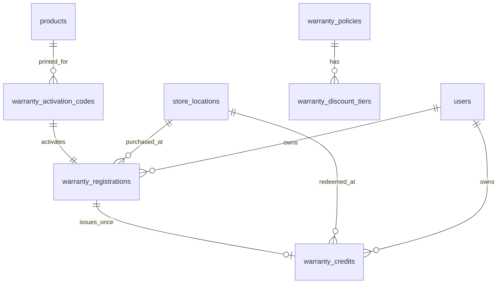

# Physical Warranty Registration — Design Spec (ASF-2)

**Date**: 2026-07-17  
**Status**: Approved for implementation planning  
**Stakeholder**: Simon (via Stanley)  
**Companion prompts**: `2026-07-17-physical-warranty-registration-agent-prompts.md`  
**Builds on**:
- Post-purchase claims (`2026-06-26-post-purchase-claims-module.md`)
- Warranty discount credits (`2026-07-09-warranty-discount-credits-design.md`)
- Store locations (`2026-06-26-store-locations-feature.md`)

---

## 1. Executive summary

Revamp warranty around **physical retail** (consignment / partner shops), not online-order defect claims.

Customers buy shoes in partner stores. Inside each box is a **premium warranty card** with a unique activation code (and optional QR). The customer:

1. Logs into the Expo customer app
2. Activates the card → product appears in a premium **My Collection** hub (Apple-device-list vibe)
3. Tracks warranty time with a **calendar** (daily ring fills over 24h → tick)
4. Sees the **current offer period** (e.g. month 1 = 75% of original pair price)
5. Claims **once** → auto-issues a fixed-RM voucher
6. Redeems **online** (cart) **or in any partner store** (show QR; staff burns voucher; till discount is manual)

**Critical product rule**: One claim per registered pair, for life. The discount % is whatever tier they are in on the day they claim. Claim early → higher %. Claim late → lower %. After claim → never eligible again for that pair.

---

## 2. Why the old model is wrong for Simon

| Old (2026-07-09 credits) | New (this spec) |
|---|---|
| Tied to online `order_items` + delivery date | Tied to **physical purchase date** + activation card |
| Photos + staff approval required | **No defect proof**; **no staff approval** to issue |
| Staff issues credits after review | Customer taps Claim → **auto-issue** at current tier |
| Redeem mainly online cart | Redeem **online OR any partner store** |
| Feels like “support tickets” | Feels like **My Collection** ownership hub |

Keep the existing `warranty_policies` + `warranty_discount_tiers` tables and math helpers. Do **not** force this flow through photo-based `claims` approval.

Online order-based claims may remain for direct web sales later; this iteration’s customer-facing hero is **physical registration**.

---

## 3. Locked decisions (2026-07-17)

| Question | Decision |
|----------|----------|
| Activation | **Card inside the box** with unique one-time code (+ QR deep link preferred) |
| Box outer QR | Optional SKU-level QR later; v1 can be “enter code / scan card QR” only |
| Auth | **Must log in** before registration form |
| Receipt photo | **Optional** |
| Staff name on form | **Optional** |
| Purchase store | Required; from `store_locations` |
| Claim count | **Once per registration** |
| Tier timing | % from days since `purchase_date` **on claim day** |
| Credit math | **Fixed RM** = `original_pair_price_myr × tier_percent / 100` |
| Staff approval | **None** for issuance |
| In-store till | Staff applies discount **manually** (no POS integration) |
| Where redeemable | **Any partner store** |
| Primary surface | **`asf-customer-app` (Expo)** first |
| Feature flag | Reuse `claims` **or** add `warranty_registration` — prefer new flag `warranty_registration` if easy; otherwise gate under `claims` |

---

## 4. Product experience (premium / Apple analogy)

Target feeling: after buying earbuds/Apple gear, there is a clean page listing **my products** with status — not a claims inbox.

### My Collection (hub)

For each registered pair show:
- Product image / name / size / color (when known)
- Purchase date + store name
- Status: `Active` | `Claimed` | `Expired` | `Redeemed`
- Current period label: e.g. “Period 1 · 75% of purchase as store credit”
- Days into warranty / days left in current tier
- CTA: **Claim offer** (only if `active` and still inside max warranty days)
- After claim: **Show voucher** until redeemed

### Detail screen — calendar

- Grid/calendar starting at `purchase_date`
- Each completed day: **tick**
- Current day: **ring** that represents progress through that 24h cycle
- Future days: empty
- This is a **visualization** of warranty time; source of truth is still `days_since_purchase` integer math

### Claim → voucher

- One tap Claim
- Server computes tier from purchase date → issues fixed RM voucher
- Registration becomes `claimed`
- UI shows large QR + 6-digit backup code + amount + expiry

---

## 5. End-to-end flow

```
┌──────────────┐   ┌──────────────┐   ┌─────────────┐   ┌──────────────────┐
│ Activate     │ → │ Track        │ → │ Claim once  │ → │ Redeem           │
│ (card code)  │   │ (calendar)   │   │ (auto RM)   │   │ online OR store  │
└──────────────┘   └──────────────┘   └─────────────┘   └──────────────────┘
```

1. **Activate** — logged-in customer enters card code (or scans card QR). Form: name, email, phone, purchase date, store, optional staff name, optional receipt. Creates `warranty_registrations` row; burns activation code.
2. **Track** — My Collection + calendar + current tier from `warranty_discount_tiers`.
3. **Claim** — one-time; auto-creates `warranty_credits` (voucher) with redemption code/QR payload; no staff.
4. **Redeem**
   - **Online**: apply voucher in cart / checkout (extend existing credit apply path).
   - **In-store**: customer shows QR; staff redeem screen validates + marks `used` with `redemption_channel = in_store` + `redeemed_store_id`; staff discounts till manually.

---

## 6. Credit math (unchanged formula, new inputs)

```
credit_amount_myr = original_pair_price_myr × (tier_percent / 100)
```

- Round MYR: `Math.round(value * 100) / 100`
- `original_pair_price_myr`: captured at registration (from product price at activate time, or staff/customer entered price if product price unavailable — prefer product catalog price)
- `tier_percent`: from active `warranty_discount_tiers` for `days_since_purchase` on claim day
- Result is a **fixed RM voucher**, not “% off whatever they buy next”

Default tiers (already seeded; merchant-editable in `/settings/warranty`):

| Days since purchase | Discount % of original pair |
|---------------------|-----------------------------|
| 0–30 | 75 |
| 31–60 | 50 |
| 61–90 | 25 |
| 91–365 | 10 |
| 366+ | ineligible |

Credit expiry: reuse policy `credit_expiry_days` (default 365) from issue date.

---

## 7. Data model

### 7.1 `warranty_activation_codes`

Unique codes printed on cards.

```sql
warranty_activation_codes (
  id UUID PRIMARY KEY DEFAULT gen_random_uuid(),
  code TEXT NOT NULL UNIQUE,              -- e.g. ASF-7K2M9P (uppercase normalized)
  product_id UUID REFERENCES products(id) ON DELETE SET NULL,
  product_color_id UUID,                  -- optional
  product_size_id UUID,                   -- optional
  batch_label TEXT,                       -- e.g. "Air Max Jun 2026 batch A"
  status TEXT NOT NULL DEFAULT 'unused'
    CHECK (status IN ('unused', 'used', 'void')),
  used_at TIMESTAMPTZ,
  used_by_user_id UUID,
  registration_id UUID,                   -- set when used
  created_at TIMESTAMPTZ NOT NULL DEFAULT NOW()
)
```

Index: unique on `upper(code)` or store codes uppercase only.

### 7.2 `warranty_registrations`

One owned physical pair.

```sql
warranty_registrations (
  id UUID PRIMARY KEY DEFAULT gen_random_uuid(),
  user_id UUID NOT NULL,                  -- auth.users
  activation_code_id UUID NOT NULL UNIQUE REFERENCES warranty_activation_codes(id),
  product_id UUID REFERENCES products(id) ON DELETE SET NULL,
  product_color_id UUID,
  product_size_id UUID,
  purchase_date DATE NOT NULL,
  purchase_store_id UUID NOT NULL REFERENCES store_locations(id),
  customer_name TEXT NOT NULL,
  customer_email TEXT NOT NULL,
  customer_phone TEXT NOT NULL,
  staff_name TEXT,                        -- optional
  receipt_url TEXT,                       -- optional Storage URL
  original_pair_price_myr NUMERIC(12,2) NOT NULL,
  policy_id UUID REFERENCES warranty_policies(id),
  status TEXT NOT NULL DEFAULT 'active'
    CHECK (status IN ('active', 'claimed', 'expired', 'void')),
  claimed_at TIMESTAMPTZ,
  warranty_credit_id UUID,                -- set on claim
  created_at TIMESTAMPTZ NOT NULL DEFAULT NOW(),
  updated_at TIMESTAMPTZ NOT NULL DEFAULT NOW()
)
```

Constraints / rules:
- One activation code → one registration
- Claim only when `status = 'active'` and within `max_warranty_days`
- After claim: `status = 'claimed'` and never claim again

### 7.3 Extend `warranty_credits`

Make credits work for registration vouchers **and** keep online-claim path compatible.

Add columns (all nullable where needed for legacy rows):

```sql
ALTER TABLE warranty_credits
  ADD COLUMN IF NOT EXISTS registration_id UUID REFERENCES warranty_registrations(id),
  ADD COLUMN IF NOT EXISTS redemption_code TEXT UNIQUE,          -- 6–8 char backup
  ADD COLUMN IF NOT EXISTS redemption_channel TEXT
    CHECK (redemption_channel IS NULL OR redemption_channel IN ('online', 'in_store')),
  ADD COLUMN IF NOT EXISTS redeemed_store_id UUID REFERENCES store_locations(id),
  ADD COLUMN IF NOT EXISTS redeemed_by_staff_id UUID;

-- Soften legacy NOT NULL on claim_id / claim_item_id for registration-issued credits:
-- Prefer: make claim_id and claim_item_id NULLABLE
-- CHECK: (claim_item_id IS NOT NULL) OR (registration_id IS NOT NULL)
```

Statuses remain: `active` | `used` | `expired` | `revoked`.

### 7.4 What we do **not** use for this flow

- Do not require `claims` photo evidence
- Do not require staff `/api/warranty/claims/approve` for issuance
- Do not invent POS payment integration

---

## 8. APIs (server-side, service role where needed)

Place under `asf-2-next/src/app/api/warranty/…` (Expo calls via existing API base URL pattern used by staff/customer apps).

| Route | Method | Auth | Purpose |
|-------|--------|------|---------|
| `/api/warranty/registrations/activate` | POST | Customer JWT | Validate code + create registration |
| `/api/warranty/registrations` | GET | Customer JWT | List my registrations + current tier preview |
| `/api/warranty/registrations/[id]` | GET | Customer JWT | Detail + calendar inputs + claim eligibility |
| `/api/warranty/registrations/[id]/claim` | POST | Customer JWT | One-time claim → issue credit + codes |
| `/api/warranty/credits/[id]/voucher` | GET | Customer JWT | Payload for QR display |
| `/api/warranty/redeem/preview` | POST | Staff JWT | Validate code/QR → show amount/status |
| `/api/warranty/redeem/confirm` | POST | Staff JWT | Mark credit used in-store |

Existing:
- `/api/warranty/credits/apply` — extend to accept registration-issued credits for online cart
- `/api/warranty/policies` — keep for tier editing

All issuance / redeem / apply must be **server-side**. Client never writes `warranty_credits` directly.

---

## 9. Surfaces by app

### Expo customer (`asf-customer-app`) — primary

| Screen | Purpose |
|--------|---------|
| Profile → My Collection | Hub list of registrations |
| Activate warranty | Enter/scan code + form (login required) |
| Registration detail | Calendar rings, current period, Claim CTA |
| Voucher screen | QR + backup code + RM amount + expiry |
| Existing warranty credits / cart | Apply online if credit active |

Deep link (preferred): `asf://warranty/activate?code=ASF-7K2M9P` (or Expo Linking scheme already used).

### Staff (`asf-staff-app` or minimal web page)

| Screen | Purpose |
|--------|---------|
| Redeem warranty | Scan/type code → preview → Confirm |

No approval queue for this flow.

### Admin web (`asf-2-next`) — can defer UI

- Batch generate activation codes (SQL seed OK for first ship)
- `/settings/warranty` already edits tiers — keep
- Optional later: print sheet UI

---

## 10. Anti-abuse (v1)

| Risk | Mitigation |
|------|------------|
| Fake ownership | Unique one-time activation code inside box |
| Claim spam | One claim per registration forever |
| Self-issue credits | Only server claim endpoint issues credits |
| Double redeem | Credit `status` single-use; redeem confirm transactional |
| Future purchase date | Reject `purchase_date > today` |
| Cross-account code theft | Code unused until activate; after use locked to first user |

Optional later: limit N activations per user per day.

---

## 11. i18n

Expo already has zh-CN / en / ms. Add keys under something like:

- `collection.*` (hub)
- `warrantyActivate.*`
- `warrantyDetail.*` (calendar, period, claim)
- `warrantyVoucher.*`
- `warrantyRedeem.*` (staff)

Do not hardcode English-only UI strings.

---

## 12. Relationship to existing modules

| Module | Action |
|--------|--------|
| `warranty_policies` / tiers | **Reuse** |
| `warranty_credits` | **Extend** for registration + in-store redeem |
| Online cart apply | **Reuse / extend** |
| Photo claims module | **Leave alone** for now (parallel path) |
| `store_locations` | **Required** for purchase store + redeem store |
| Promotions | **Do not merge** warranty vouchers into promotions |

---

## 13. Out of scope (this iteration)

- POS / till integration
- Unique QR artwork printed per box (card code is enough)
- Admin print-shop UI for thousands of codes (seed/SQL first)
- AI / photo defect verification
- Auto-approve of old online manufacturing_defect claims
- Changing tier table defaults (Simon edits in settings later)
- Partner-specific redemption restrictions (any store is OK)

---

## 14. Success criteria

- [ ] Customer must be logged in to activate a card code
- [ ] Valid unused code creates a registration linked to product + store + purchase date
- [ ] My Collection lists registrations with current tier / status
- [ ] Detail calendar visualizes days since purchase (ring → tick)
- [ ] Claim once issues fixed RM credit = original price × current tier %
- [ ] After claim, second claim is rejected
- [ ] Customer can show voucher QR/code
- [ ] Staff redeem confirms → credit `used`, channel `in_store`, store recorded
- [ ] Same credit can alternatively be applied online (mutually exclusive)
- [ ] `npx tsc --noEmit` passes in touched packages
- [ ] Do not run `npm start` / production builds unless asked

---

## 15. Entity relationship



---

## 16. Implementation order (see prompts doc)

1. Schema + types + seed helper for activation codes  
2. Server APIs (activate, list, claim, redeem)  
3. Expo My Collection + Activate  
4. Expo Detail calendar + Claim + Voucher  
5. Staff Redeem screen  

---

*End of design spec.*
