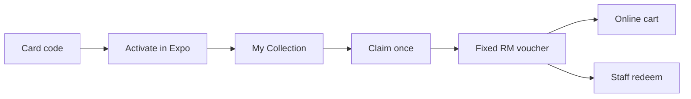

# Physical warranty registration (ASF-2)

Card-in-box **physical warranty** for consignment / partner retail, shipped 2026-07-17. Primary sources: [raw design](raw/sources/2026-07-17-physical-warranty-registration-design.md), [[wiki/sources/2026-07-17-physical-warranty-registration-session-accomplishment]].

## Core rule

One claim per registered pair. Discount = tier % on claim day × **original pair price** → **fixed RM** voucher. Early claim = higher %; claiming spends the benefit forever. No proof / no staff approval to issue. Redeem online or any partner store (staff burns code; till is manual).

## Flow

## Surfaces

- Expo: Profile → My Collection / Activate / Detail (Month 1–12 tabs, month-scoped calendar, product hero)
- Staff: Redeem warranty (`warranty_registration` flag)
- Next: `/api/warranty/registrations/*`, `/redeem/*`
- Flag: `warranty_registration`

## Contradiction / open tension

[[wiki/concepts/warranty-discount-credits-asf-2]] remains for **online photo + staff-approve** claims. Physical registration is the **Simon retail SOT** and intentionally skips approval. Do not mix the two flows in customer UX without an explicit product decision.

## Related

- [[wiki/concepts/store-locations-feature-asf-2]]
- [[wiki/concepts/warranty-discount-credits-asf-2]]
- [[wiki/concepts/post-purchase-claims-module-asf-2]]
- [[wiki/entities/asf-2]]
