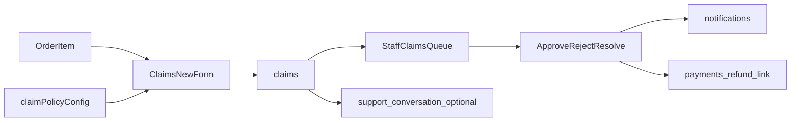

# Post-purchase claims module (ASF-2)

Pattern for a **reusable, flag-gated claims module** added 2026-06-26. Primary source: [[wiki/sources/2026-06-26-post-purchase-claims-module]].

## Purpose

Let customers report post-purchase issues (warranty defects, returns, delivery damage) against a **specific order line item**, with staff review and structured resolutions. Designed to copy across client deployments by swapping policy config — not by forking code.

## Naming rule

- Code and DB: **`claims`** (module, table, feature flag)
- Business copy: configurable (`Warranty & Returns`, `Order Issues`, `Freshness Guarantee`, etc.)
- Shoe store: manufacturing defect, size exchange, wrong item, delivery damage

## Architecture

## Data model

- `claims` — user, order, order_item, product, type, status, evidence, resolutions
- `claim_status_change_logs` — audit trail (same pattern as tickets/orders)
- Statuses: `submitted` → `in_review` → `needs_info` | `approved` | `rejected` → `resolved`

## Policy portability surface

**Single swap file:** `asf-2-next/src/modules/claims/claimPolicyConfig.ts`

Defines module label, claim types, eligibility days, required photos, allowed resolutions, and customer-facing copy on product page.

## Context pattern

| Bundle | Use |
|--------|-----|
| `ClaimsCustomerProviders` | Gated in `SlimLandingContextBundle` |
| `ClaimsContextBundle` | Staff queue |
| `ClaimsWithSupportContextBundle` | Staff detail + conversation |

Modeled on [[wiki/concepts/store-locations-feature-asf-2]] Gate pattern and [[wiki/concepts/context-provider-architecture-asf-2]] provider bundles.

## Customer surfaces

- Product PDP: care + warranty accordions (when flag on)
- Order detail: per-item claim CTA after delivery
- `/claims`, `/claims/new`, `/claims/[id]`
- Settings link

## Staff surfaces

- Sidebar **Claims** (flag-gated)
- Queue with tabs/filters (Support page pattern)
- Detail: assign, status transitions, approve modal, payment refund link, start chat

## Feature flag

Key: `claims` in `feature_flags`. Seed in `docs/sql/step_11_claims.sql`.

## Known gaps (v1)

- Migration must be run on Supabase
- Photo evidence = URL paste, not Storage upload
- Eligibility uses order `created_at`, not delivery event
- Web-only; mobile apps not yet updated
- Policy is code-backed, not admin UI

## Evolution — warranty discount credits (2026-07-09)

Several v1 gaps above were addressed by the **warranty discount credits** system built on top of this module (see [[wiki/concepts/warranty-discount-credits-asf-2]], [[wiki/sources/2026-07-09-warranty-discount-credits-design]]):

- Delivery event now sourced from `order_status_logs` (`new_status = 'delivered'`), not `order.created_at`.
- Policy tiers moved to DB (`warranty_policies` + `warranty_discount_tiers`) with a `/settings/warranty` admin UI; `claimPolicyConfig.ts` kept as fallback.
- Multi-item claims via new `claim_items`; per-item human-approved credits issued into `warranty_credits` and redeemed one-click in cart.

The `claims` feature flag, table, and code name are **kept and extended**, not replaced.

## Related

- [[wiki/entities/asf-2]]
- [[wiki/sources/2026-06-26-post-purchase-claims-module]]
- [[wiki/concepts/warranty-discount-credits-asf-2]]
- [[wiki/sources/2026-07-09-warranty-discount-credits-design]]
- [[wiki/concepts/store-locations-feature-asf-2]]
