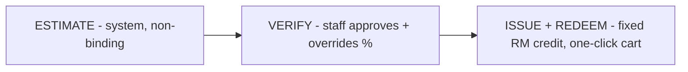

# Warranty discount credits (ASF-2)

Human-verified **warranty credit** system layered on the [[wiki/concepts/post-purchase-claims-module-asf-2]] (`claims` feature flag), designed 2026-07-09 and shipped in `asf-2-next`. Primary source: [[wiki/sources/2026-07-09-warranty-discount-credits-design]].

## Core rule

Time-based discount tiers are **recommendations only**. No credit, refund, or cart discount is granted without **staff approval**. All credit issuance and cart validation happen **server-side** with the service-role client, so a client cannot self-issue value.

## Three-stage model

1. **Estimate** — customer picks order line item(s) + claim type; system computes days since delivery and shows *estimated* % and RM credit. Copy is always "Estimated credit if approved".
2. **Verify** — staff review evidence; per line item they see the recommended tier % and can edit the approved % (any staff role, partial approval allowed).
3. **Issue + Redeem** — approve creates one `warranty_credit` per line item; customer applies it one-click in cart on any product; checkout validates and marks it `used`.

## Credit math

`credit_amount_myr = line_item_paid_price × approved_percent / 100` → a **fixed RM amount** (not a running % off). MYR rounding `Math.round(v*100)/100`.

Default merchant-editable tiers (auto-applied to `manufacturing_defect` only):

| Days since delivery | Discount % |
|---|---|
| 0–30 | 75% |
| 31–60 | 50% |
| 61–90 | 25% |
| 91–365 | 10% |
| 366+ | ineligible (auto tier) |

Other claim types (`size_exchange`, `wrong_item`, `delivery_damage`) have no auto tier — staff set % manually (often 100%).

## Data model (new)

- `warranty_policies` — store-wide policy (max_warranty_days, credit_expiry_days, module_label).
- `warranty_discount_tiers` — day-range → percent rows under a policy.
- `claim_items` — links a `claims` row to multiple `order_items` with per-item price, days-since-delivery, recommended/approved %, credit amount, and issued `warranty_credit_id`.
- `warranty_credits` — issued credit: `user_id`, amount, status (`active`/`used`/`expired`/`revoked`), `expires_at` (approved + 365d), `used_order_id`, `issued_by`.
- `claims` extended with `eligibility_start_at` (real delivery ts) + `policy_id`.
- Optional `warranty_claim_type_rules` (or keep per-type rules in `claimPolicyConfig.ts`).

Delivery date comes from the first `order_status_logs` row where `new_status = 'delivered'` — **not** `order.created_at`.

## How it extends the claims module

| Claims v1 gap | Warranty credits resolution |
|---|---|
| Binary eligible/ineligible | Time-based discount tiers |
| Policy hardcoded in `claimPolicyConfig.ts` | Tiers move to DB (`warranty_policies` + tiers), config kept as fallback |
| No computed credit / no redemption | `warranty_credits` + one-click cart apply + checkout burn |
| Single item per claim | Multi-item via `claim_items` |
| Delivery proxy `order.created_at` | `order_status_logs` delivered event |
| Client-side Supabase risk | Server-side issuance + validation |

## Anti-abuse safeguards

Human approval required; must link a delivered order line item; one active claim per `order_item_id`; photos required for defect claims; credits account-locked and single-use; server-side issuance and cart validation; audit via `claim_status_change_logs`; customer copy always "estimated" until approved. Deliberately **separate from `promotions`** to avoid shared-code discount abuse.

## Surfaces

- **Staff**: `/settings/warranty` (tier editor), `/claims` queue (estimated total column), `/claims/[id]` per-item tier panel + "Approve & Issue Credits".
- **Customer**: `/order-details/[orderId]` multi-select → report issue, `/my-claims/new` estimate preview, `/my-claims/[id]` issued credits, `/my-account/warranty-credits`, cart apply, checkout consumption.

## Status & open tension

Shipped web-only in `asf-2-next` (all 7 implementation agents ran). The design scoped `asf-customer-app` (Expo) as out-of-scope for v1, but a mobile warranty port also appears in progress — reconcile scope in a future ingest. See [[wiki/sources/2026-07-09-warranty-discount-credits-design]] open questions.

## Related

- [[wiki/entities/asf-2]]
- [[wiki/concepts/post-purchase-claims-module-asf-2]]
- [[wiki/sources/2026-06-26-post-purchase-claims-module]]
- [[wiki/concepts/context-provider-architecture-asf-2]]
